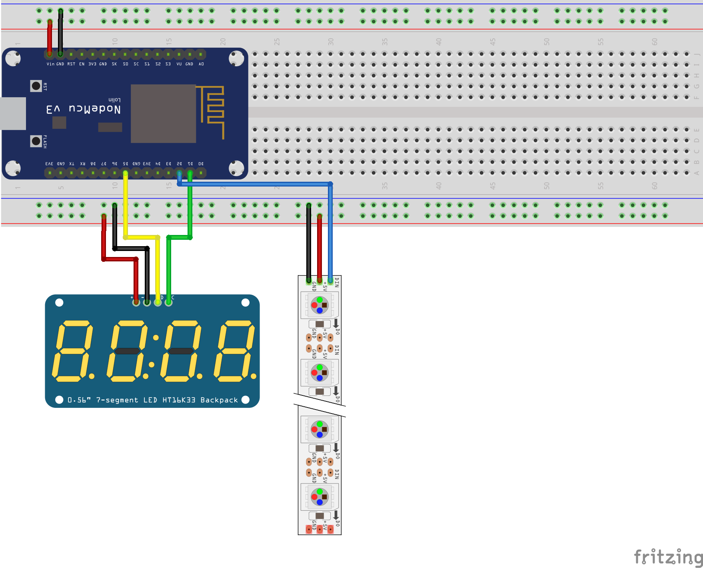

# Lightclock

Light alarm clock based on [instructable circuits light alarm clock](https://www.instructables.com/DIY-22/)

## Components used:

* NodeMCU Amica Modul V2 ESP8266 ESP-12E 
* 0.36" 4-Digit Tube LED 7-Segment Display Module Red Common Anode TM1637
* CHINLY WS2812B 16.4ft/5M Individually Addressable LED Strip 5050 RGB

## Notes on implementing the clock

### Power and Consumption
Clock can be powered by the micro usb board, given you use one meter of 60 leds. Seems to be drawing:

* 1.3A at 5V (6.5W) when all leds at full intensity
* 0.5A at 5V (2.5W) when all leds at half intensity
* 0.15A at 5V (0.75W) when all leds are off
* 0.17A at 5V (0.85W) when in analog clock mode

### Leds used are RGB (not RGBW)

So adjust driver library parameters when playing with the leds. strip.color does not take a parameter for white, white needs to be encoded as RGB colors evenly powered.

### Notes on the original wiring drawing

In the original drawing (see below), __D1__ is wired to __clk__ and __D5__ to __DIO__ of the 7-segment display. The source code however takes __D5__ for __clk__ and __D1__ for __DIO__. Make sure to correct either wiring or source code.



When powering the clock through micro-USB, use __VIN__ and __GND__ to power the led display and the led strip.

### Note on wiring the strip

* Do not make the mistake of overpowering the strip like I did. I will destroy some leds. 
* Make sure to wire the led in in the correct direction. The strip contains arrows, showing the the data direction.


### Illegal instruction when using original code

When using the original code, an illegal instruction exception occurred. The feedback from the exception is suboptimal. The culprit was 

```c
unsigned int sendNTPpacket(IPAddress & address)` {
    // ...
}
```

being declared as `usigned int` but not returning a value. I changed it to void, to fix.

### Case size and the analog clock

The analog clock assumes the current circumference of the 3d printed inner-case. The led strip should be sticked to the inner case clock-wise and the first led should be on top (12 'o Clock so to speak). It will go around the case exactly 3-times.

### PCB 

You do not need an extra PCB, but it may help to keep everything in place.

## TODO

* the code is a mess - clean up - maybe even test drive a new implementation
* the web interface does not show the current alarm time value - would be very nice
* remove all whites


